# ✨ Parallel Worlds Trip 🌟

<div align="center">


*Discover your parallel universe self and steal their incredible travel adventures*

[🚀 Get Started](#-quick-start) • [🎯 Features](#-features) • [🛠️ Setup](#-installation--setup) • [📖 Documentation](#-how-it-works)

</div>

---

## 🌌 What is Parallel Worlds Trip?

**Parallel Worlds Trip** is an revolutionary AI-powered travel application that takes you on a journey of self-discovery through alternate realities. Ever wondered who you could be in another universe? What if you were a billionaire in Dubai, a student in Mumbai, or an artist in Paris? 

This app uses cutting-edge AI to generate your parallel universe persona and creates personalized travel itineraries based on that alternate version of yourself. It's not just travel planning—it's **multiverse exploration**.

### 🎭 The Concept

> *"What if you lived differently? Discover your alternate universe self, steal their amazing travel itinerary, and earn Universe Points by living their adventures."*

---

## ✨ Features

<div align="center">

| 🧠 **AI-Powered Discovery** | 🎨 **Visual Generation** | 🗺️ **Smart Itineraries** |
|:---:|:---:|:---:|
| Uses Google Gemini AI to create your parallel universe persona | Generates stunning visuals with OpenAI's DALL-E 3 | Creates detailed 7-day personalized travel plans |

| 🎮 **Gamification** | 📱 **Modern UI** | 🎯 **Personalization** |
|:---:|:---:|:---:|
| Universe Points system for completing activities | Beautiful glassmorphism design with cosmic animations | Tailored experiences based on your parallel self |

</div>

### 🌟 Key Features

- **🔮 Parallel Self Generator**: Advanced AI creates your alternate universe persona
- **📸 AI Image Generation**: See yourself in your parallel life with DALL-E 3
- **🗺️ Smart Itinerary Planning**: 7-day detailed travel plans with insider tips
- **⚡ Universe Points System**: Gamified experience with achievements
- **🎨 Cosmic Design**: Beautiful glassmorphism UI with space-themed animations
- **📱 Responsive**: Perfect experience on all devices
- **🚀 Fast**: Built with Vite for lightning-fast performance

---

## 🚀 Quick Start

```bash
# Clone the repository
git clone https://github.com/PavitarSinghArneja/parallel-worlds-trip.git

# Navigate to project
cd parallel-worlds-trip

# Install dependencies
npm install

# Set up environment variables (see setup guide below)
cp .env.example .env

# Start the cosmic journey
npm run dev
```

🌐 **Open [http://localhost:5173](http://localhost:5173)** and begin your parallel universe adventure!

---

## 🛠️ Installation & Setup

### Prerequisites

- **Node.js** (v18 or higher)
- **npm** or **yarn**
- **API Keys** (Google Gemini & OpenAI)

### 1. 📦 Install Dependencies

```bash
npm install
```

### 2. 🔑 API Keys Setup

You'll need two API keys to power the AI features:

#### 🤖 Google Gemini AI (Text Generation)
1. Visit [Google AI Studio](https://aistudio.google.com/)
2. Create a new project and generate an API key
3. Copy your API key

#### 🎨 OpenAI (Image Generation)
1. Go to [OpenAI Platform](https://platform.openai.com/)
2. Create account and add billing information
3. Navigate to API Keys section
4. Generate a new secret key
5. Copy your API key

### 3. ⚙️ Environment Configuration

```bash
# Copy the example environment file
cp .env.example .env
```

Edit `.env` and add your API keys:

```env
# AI Configuration
VITE_GEMINI_API_KEY=your_gemini_api_key_here
VITE_OPENAI_API_KEY=your_openai_api_key_here

# Optional: Custom Configuration
VITE_APP_NAME="Parallel Worlds Trip"
VITE_APP_VERSION="1.0.0"
```

### 4. 🚀 Launch the Application

```bash
# Development server
npm run dev

# Production build
npm run build

# Preview production build
npm run preview

# Lint code
npm run lint
```

---

## 🎯 How It Works

```mermaid
graph TD
    A[🎭 Take Quiz] --> B[🧠 AI Analysis]
    B --> C[🎨 Generate Parallel Self]
    C --> D[📸 Create AI Image]
    D --> E[🗺️ Build Custom Itinerary]
    E --> F[⚡ Earn Universe Points]
    F --> G[🏆 Unlock Achievements]
```

<div align="center">



</div>

### 📋 Step-by-Step Journey

#### 1. 🎭 **Discover Your Parallel Self**
Take an engaging quiz about your dream lifestyle, personality, and aspirations:
- **Lifestyle Choices**: Where would you live if you could live anywhere?
- **Personality Traits**: What if you had unlimited confidence?
- **Adventure Preferences**: What if money was no object?
- **Travel Interests**: Food, nightlife, culture, or nature?
- **Budget Style**: Luxury, comfort, balanced, or backpacker?

#### 2. 📅 **Plan Your Adventure**
- Select your travel dates
- Let AI determine the perfect destination based on your parallel life

#### 3. 🔮 **AI Generates Your Parallel Universe**
Our advanced AI creates:
- **Persona**: Detailed description of your alternate self
- **Lifestyle**: How you live in this parallel universe
- **Backstory**: Your parallel life's journey and achievements

#### 4. 🎨 **Visual Representation**
- Upload a selfie (optional) for personalized image generation
- AI creates stunning visual of your parallel self using DALL-E 3

#### 5. 🗺️ **Comprehensive Itinerary Creation**
Receive a detailed 7-day travel plan including:

<details>
<summary><strong>📋 Itinerary Features</strong></summary>

- **🌅 Day-by-Day Schedule**: Morning, afternoon, and evening activities
- **🍽️ Restaurant Recommendations**: Specific dishes and insider spots
- **🏛️ Must-Visit Attractions**: With tips and best times to visit
- **🏨 Accommodation Suggestions**: Hotels matching your style and budget
- **🚗 Transportation Guide**: Local transport tips and cost-saving advice
- **🤫 Local Secrets**: Hidden gems and insider knowledge
- **💰 Budget Estimates**: Realistic cost breakdowns
- **🌤️ Weather Considerations**: Packing lists and seasonal tips
- **📱 Practical Info**: Contact numbers, emergency info, and local customs

</details>

#### 6. ⚡ **Universe Points & Gamification**
- Complete activities to earn Universe Points
- Unlock achievements and badges
- Track your parallel universe exploration progress

---

## 🏗️ Project Architecture

### 📁 Project Structure

```
parallel-worlds-trip/
├── 📁 public/
│   ├── favicon.ico
│   ├── placeholder.svg
│   └── robots.txt
├── 📁 src/
│   ├── 📁 assets/
│   │   └── parallel-hero.jpg
│   ├── 📁 components/
│   │   ├── 📁 ui/           # shadcn/ui components
│   │   ├── DetailedItinerary.tsx
│   │   ├── HeroBanner.tsx
│   │   ├── QuizForm.tsx
│   │   ├── SelfieUploader.tsx
│   │   └── UniversePoster.tsx
│   ├── 📁 contexts/
│   │   └── AuthContext.tsx
│   ├── 📁 hooks/
│   │   ├── use-mobile.tsx
│   │   └── use-toast.ts
│   ├── 📁 lib/
│   │   ├── gemini.ts       # Gemini AI integration
│   │   ├── openai.ts       # OpenAI integration
│   │   └── utils.ts        # Utility functions
│   ├── 📁 pages/
│   │   ├── Index.tsx       # Landing page
│   │   ├── Quiz.tsx        # Interactive quiz
│   │   ├── Reveal.tsx      # Parallel self reveal
│   │   ├── Trip.tsx        # Travel itinerary
│   │   └── Profile.tsx     # User profile
│   ├── 📁 types/
│   │   └── index.ts        # TypeScript definitions
│   ├── App.tsx
│   ├── main.tsx
│   └── index.css
├── package.json
├── tailwind.config.ts
├── vite.config.ts
└── README.md
```

### 🔧 Tech Stack

<div align="center">

| Category | Technologies |
|:---------|:------------|
| **Frontend** | React 18.3.1, TypeScript 5.8.3, Vite 5.4.19 |
| **UI/UX** | shadcn/ui, Tailwind CSS, Glassmorphism Design |
| **AI Integration** | Google Gemini AI, OpenAI DALL-E 3 |
| **Routing** | React Router DOM 6.30.1 |
| **State Management** | React Context API, TanStack React Query |
| **Form Handling** | React Hook Form, Zod Validation |
| **Icons & Assets** | Lucide React, Custom Cosmic Animations |

</div>

---

## 🎨 Design System

### 🌌 Cosmic Theme
- **Glassmorphism**: Frosted glass effects with cosmic backgrounds
- **Neon Accents**: Glowing elements and hover effects
- **Space Animations**: Floating particles and cosmic movements
- **Color Palette**: Deep space blues, electric purples, cosmic greens

### 🎭 Key Components

#### `HeroBanner.tsx`
The landing page hero with cosmic animations and call-to-action.

#### `QuizForm.tsx`
Multi-step form for discovering your parallel universe preferences.

#### `UniversePoster.tsx`
AI-generated poster showcasing your parallel self with visual representation.

#### `DetailedItinerary.tsx`
Comprehensive travel plan with day-by-day breakdown and interactive elements.

---

## 🔧 API Integration

### 🤖 Google Gemini AI
```typescript
// src/lib/gemini.ts
import { GoogleGenerativeAI } from '@google/generative-ai';

const genAI = new GoogleGenerativeAI(import.meta.env.VITE_GEMINI_API_KEY);
```

**Features:**
- Parallel universe persona generation
- Travel itinerary creation
- Contextual recommendations

### 🎨 OpenAI DALL-E 3
```typescript
// src/lib/openai.ts
import OpenAI from 'openai';

const openai = new OpenAI({
  apiKey: import.meta.env.VITE_OPENAI_API_KEY,
  dangerouslyAllowBrowser: true
});
```

**Features:**
- AI image generation
- Parallel self visualization
- Custom poster creation

---

## 📱 Usage Examples

### 🎭 Example Parallel Universe Scenarios

1. **🎓 Student in Mumbai**: Exploring local markets, studying at cafes, experiencing college life
2. **💎 Billionaire in Dubai**: Luxury shopping, exclusive dining, private experiences
3. **🎨 Artist in Paris**: Gallery visits, studio tours, creative inspiration
4. **👨‍🍳 Chef in Bangkok**: Street food exploration, cooking classes, culinary adventures
5. **🏎️ Racer in Monaco**: Adrenaline sports, luxury lifestyle, high-speed experiences

### 🌟 Sample Quiz Response
```json
{
  "lifestyle": "I would want to be a tech entrepreneur in Singapore, building the next unicorn startup",
  "personality": "entrepreneur",
  "adventure": "experiences",
  "interests": "nightlife_social",
  "budget": "luxury",
  "startDate": "2024-03-15",
  "endDate": "2024-03-22"
}
```

---

## ⚠️ Important Notes

### 💰 API Costs
- **Google Gemini**: Pay-per-use pricing for text generation
- **OpenAI DALL-E 3**: ~$0.04 per image generation
- **Monitor Usage**: Set up billing alerts in both platforms

### 🔒 Security Considerations
- **Environment Variables**: Never commit API keys to version control
- **Browser Limitations**: OpenAI integration uses `dangerouslyAllowBrowser: true`
- **Production**: Implement backend proxy for API calls in production

### 📊 Performance
- **Rate Limits**: Be aware of API rate limits
- **Caching**: Implement response caching for better UX
- **Error Handling**: Graceful degradation for API failures

---

## 🚀 Deployment

### 🌐 Vercel (Recommended)

```bash
# Install Vercel CLI
npm i -g vercel

# Deploy
vercel

# Set environment variables in Vercel dashboard
# VITE_GEMINI_API_KEY
# VITE_OPENAI_API_KEY
```

### 🐳 Docker
```dockerfile
FROM node:18-alpine
WORKDIR /app
COPY package*.json ./
RUN npm install
COPY . .
RUN npm run build
EXPOSE 4173
CMD ["npm", "run", "preview"]
```

### 📋 Build Commands
```bash
# Build for production
npm run build

# Preview production build locally
npm run preview

# Lint before deployment
npm run lint
```

---

## 🤝 Contributing

We welcome contributions to make Parallel Worlds Trip even more amazing!

### 🛠️ Development Setup
1. Fork the repository
2. Create a feature branch: `git checkout -b feature/amazing-feature`
3. Follow the setup instructions above
4. Make your changes
5. Test thoroughly
6. Submit a pull request

### 📝 Guidelines
- Follow existing code style and conventions
- Write clear commit messages
- Add tests for new features
- Update documentation as needed

---

## 📄 License

This project is licensed under the **MIT License** - see the [LICENSE](LICENSE) file for details.

---

## 🏆 Hackathon Victory Story

### 💎 **₹100,000 Winner - Last Minute Magic!**

This project was our **winning submission** that secured **₹100,000 INR** at the hackathon! What made it even more incredible was the **last-minute addition** that pushed us over the edge to victory.

**🚀 The Game-Changing Addition:**
In the final hours before submission, I implemented a **revolutionary feature** - the **AI-powered parallel universe persona generation with visual representation**. This wasn't just another travel app anymore; it became an immersive multiverse experience that captivated the judges.

**✨ What Made Us Win:**
- **Innovation Factor**: The concept of discovering your parallel self was completely unique
- **AI Integration Excellence**: Seamless combination of Google Gemini AI and OpenAI DALL-E 3
- **User Experience**: Beautiful glassmorphism UI with cosmic animations
- **Technical Execution**: Full-stack implementation with modern tech stack
- **Market Potential**: Judges recognized the viral potential of parallel universe travel

**🎯 The Winning Moment:**
When we demoed the app generating a "billionaire in Dubai" persona for a judge and watching their face light up as DALL-E created their parallel self's image - that's when we knew we had something special.

**🔥 Last-Minute Implementation Details:**
- Built the entire AI persona generation system in under 6 hours
- Integrated OpenAI DALL-E 3 API for image generation at 3 AM
- Created the cosmic UI animations during the final presentation prep
- Added the gamification system (Universe Points) during judging breaks

This victory proves that **innovation + execution + a touch of cosmic magic** can create something truly extraordinary!

---

## 🌟 Acknowledgments

- **Google Gemini AI** for powerful text generation capabilities
- **OpenAI** for amazing image generation with DALL-E 3
- **shadcn/ui** for beautiful, accessible components
- **The React Community** for incredible tools and libraries
- **Our Hackathon Team** for pulling off this last-minute miracle
- **The Judges** who recognized the potential of parallel universe travel

---

<div align="center">

### 🚀 Ready to discover your parallel universe?

**[Start Your Journey](http://localhost:5173)** • **[Report Issues](https://github.com/PavitarSinghArneja/parallel-worlds-trip/issues)** • **[Contribute](https://github.com/PavitarSinghArneja/parallel-worlds-trip/pulls)**

---

*Made with ❤️ and ✨ by travelers who dream of parallel universes*

**⭐ Star this repo if you love exploring alternate realities! ⭐**

</div>